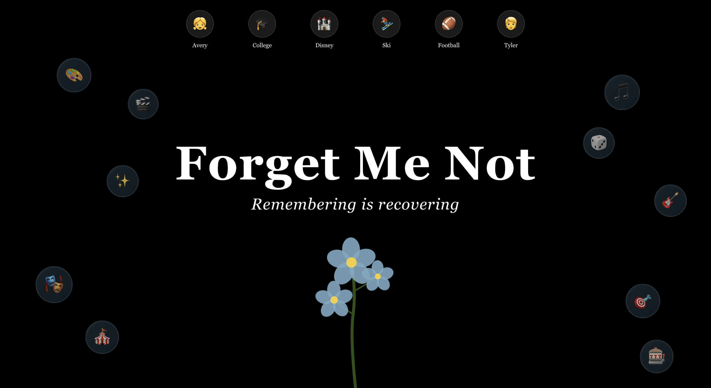
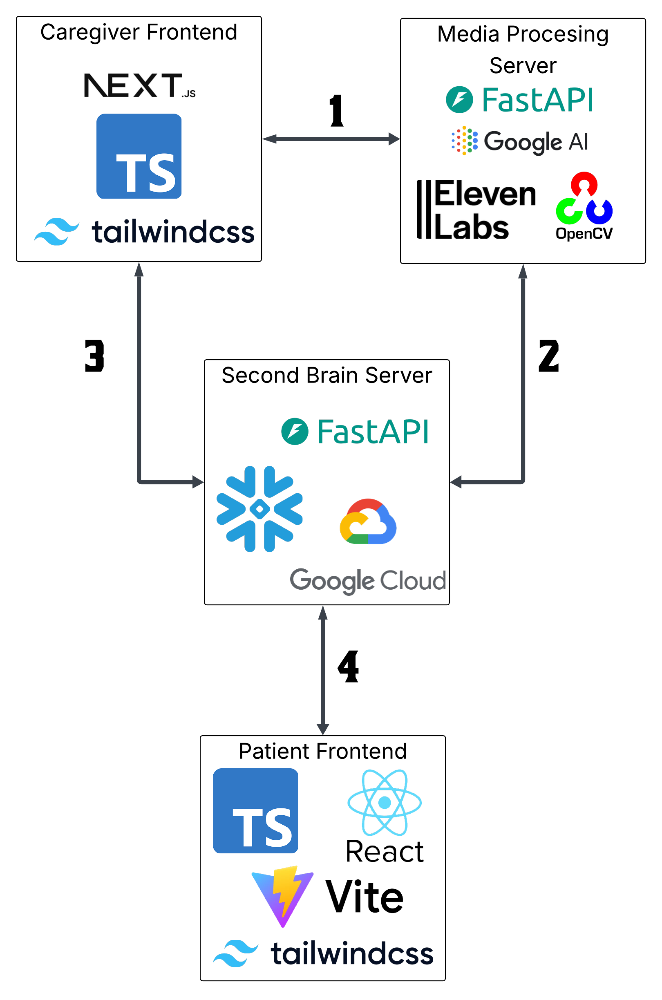

# Forget Me Not - Remembering Is Recovering

**Forget Me Not** is an end-to-end platform that enables caregivers and medical professionals to collaboratively create personalized virtual experiences for dementia patients.  
By combining multimodal AI, voice synthesis, and intuitive dashboards, the system helps patients relive meaningful memories while providing caregivers with valuable insights into engagement and recall.

---

## Screen Shot Of Patient Portal

## System Overview

Forget Me Not consists of three main layers:

1. **Frontends**
   - **Caregiver Frontend:** Built with Next.js, TypeScript, and Tailwind CSS. Used for uploading media, labeling faces, and creating personalized experiences.
   - **Patient Frontend:** Built with React, TypeScript, Vite, and Tailwind CSS. Provides an intuitive interface for patients to access and relive generated experiences.

2. **Media Processing Server**
   - Powered by FastAPI, Google AI, ElevenLabs, and OpenCV.
   - Handles facial recognition, image captioning, context extraction, and voice generation.
   - Processes caregiver-uploaded media into structured data and audio-visual assets.

3. **Second Brain Server**
   - Also built on FastAPI, integrated with Snowflake and Google Cloud.
   - Stores processed media, metadata, and analytics.
   - Acts as the central hub for managing patient data, experience retrieval, and analysis.

---

## Data Flow

| Step | Communication | Description |
|------|----------------|-------------|
| 1 | Caregiver Frontend → Media Processing Server | Media files are uploaded and analyzed using AI tools. |
| 2 | Media Processing Server → Second Brain Server | Structured data and processed media are stored for retrieval. |
| 3 | Second Brain Server → Caregiver Frontend | Dashboard displays analytics and allows further experience management. |
| 4 | Second Brain Server ↔ Patient Frontend | Delivers immersive, AI-narrated experiences to patients and collects feedback data. |

---

## Core Features

### Caregiver Portal
- Upload and label patient media.
- Generate narrated, AI-enhanced experiences.
- Access engagement metrics and memory usage analytics.

### Patient Portal
- Simple interface for browsing and replaying experiences.
- Real-time narration via voice cloning and text-to-speech.
- Conversational AI agents replicating familiar voices.

---

## Technologies

| Category | Stack |
|-----------|--------|
| **Frontend** | Next.js, React, TypeScript, Vite, Tailwind CSS |
| **Backend** | FastAPI, Pydantic |
| **AI & Processing** | Google AI Platform, ElevenLabs, OpenCV |
| **Data & Cloud** | Snowflake, Google Cloud (Buckets, BigQuery) |
| **Integration** | REST APIs between FastAPI servers |
 

---

## Mission

Forget Me Not combines empathy and technology to support dementia care — helping patients reconnect with their memories while empowering caregivers to create more meaningful therapeutic experiences.

